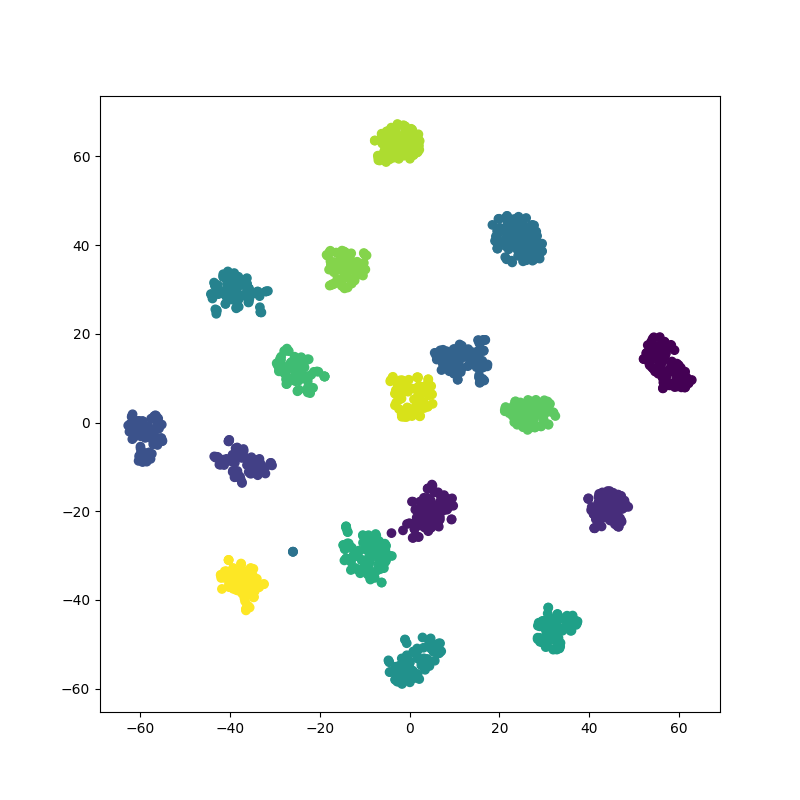

Triplet loss for facial recognition.

# Triplet Face

The repository contains code for the application of triplet loss training to the
task of facial recognition. This code has been produced for a lecture and is not
going to be maintained in any sort.

## Work done

On commence par préparer l'environnement de travail en plusieurs étapes:

### 1) Import du projet de Github sur Colab
```bash
!git clone https://github.com/LouisVanHecke/TripletFace.git
```
### 2) Ajout du drive sur lequel est le dataset sur Colab
```bash
from google.colab import drive
drive.mount('/content/drive')
```
### 3) Installation des bibliothèques utilisées par la suite :
```bash
!pip3 install -r TripletFace/requirements.txt
```

## Modification du modèle

Le code d'entrainemment fourni dans le code à disposition était le resnet18. Ce
model est plus ancien et a été amélioré depuis. Vu que nous utilisons la bibliothèque pytorch et en lisant la documentation ([Pytorch](https://pytorch.org/docs/stable/torchvision/models.html)), j'ai décidé d'utiliser le modéle resnet-152 déjà entrainé. Cette modification à été faite dans model.py.
Une autre possibilité aurait été d'utiliser des modéles présent dans d'autres bibliothèques.

## Entrainement

N'ayant pas réussi à utiliser le réseau de neurones par la suite il était compliqué d'observer quels hyperparamètres étaient les plus intéresant à modifier. L'entrainement que je suppose étre le plus performant est celui réalisé en modifiant le nombre d'epoch à 4 et un learning rate de 2e-3

J'ai obtenu le résultat suivant pour l'epoch 4:


J'ai enregistré les résultats des epoch sur mon drive au lien suivant: [GDrive](https://drive.google.com/drive/folders/1uhcJnDf9cjC4W0W6JNjokWk4sISk1wDs?usp=sharing)

## Jit Compile

Ensuite il a fallu compiler le réseau à l'aide du compiler de la bibliothèque de Pytorch. Le code est le suivant :
```bash
import torch
import torch.nn as nn
from tripletface.core.model import Encoder

model = Encoder(64)
weigths = torch.load("/content/drive/My Drive/modelResnet152V7/model.pt")['model']
model.load_state_dict(weigths)
jit_model = torch.jit.trace(model, torch.rand(64, 3, 7, 7))
torch.jit.save(jit_model, "jitmodel.pt")
```
Le jitmodel étant trop volumineux pour Github je l'ai sauvegardé dans le même dossier que précédemment sur GDrive.

## Identification des Centroids et des Thresholds des élèves

Je n'ai malheuresement pas réussi à réaliser les scripts comme dit précédemment. La logique était des prendres un nombre fixe d'image pour chaque personne, puis de les faire passer dans le réseau et de faire la moyenne des positions pour obtenir le Centroid puis de prendre la distance du plus éloigné pour avoir le Threshhold.

## References

* Resnet Paper: [Arxiv](https://arxiv.org/pdf/1512.03385.pdf)
* Triplet Loss Paper: [Arxiv](https://arxiv.org/pdf/1503.03832.pdf)
* TripletTorch Helper Module: [Github](https://github.com/TowardHumanizedInteraction/TripletTorch)
* Pytorch Documentation : [Pytorch](https://pytorch.org/docs/stable/torchvision/models.html)
